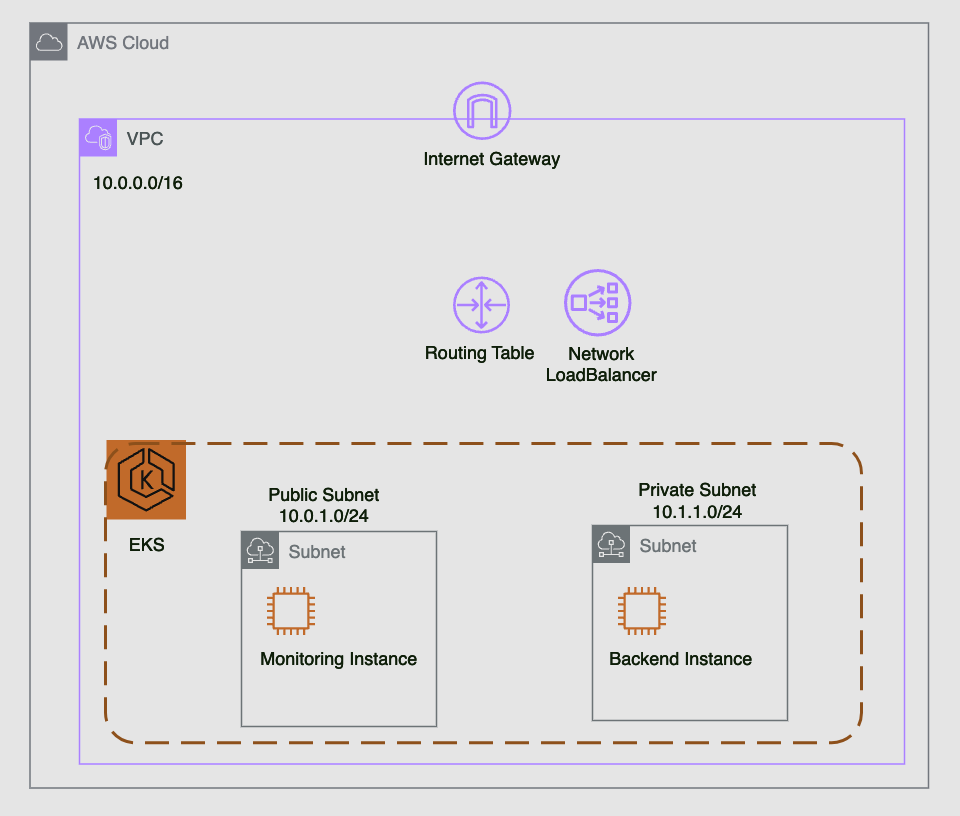

# 인프라 아키텍처

## 설계 목표

1. **고가용성**: 인프라를 설계할 때 고가용성을 고려했습니다. 퍼블릭 및 프라이빗 서브넷을 사용하여 애플리케이션과 클러스터를 서로 다른 서브넷에 배치하여 장애가 발생해도 전체 시스템이 영향을 받지 않도록 했습니다.
2. **보안**: 퍼블릭 서브넷에는 인터넷에 직접 연결된 인스턴스를 배치하고, 프라이빗 서브넷에는 외부 접근이 제한된 인스턴스를 배치했습니다. 이를 통해 민감한 데이터와 애플리케이션이 보다 안전하게 보호될 수 있도록 설계했습니다.
3. **확장성**: EKS 클러스터와 EC2 인스턴스의 노드 그룹을 설정하여 필요에 따라 리소스를 확장할 수 있도록 했습니다. 또한, Network Load Balancer(NLB)를 사용하여 높은 트래픽 부하를 효과적으로 처리할 수 있도록 했습니다.

## 구성 요소

### 1. **Amazon EKS 클러스터**

- **리소스**: `aws_eks_cluster`
- **이름**: `example-eks-cluster`
- **역할**: EKS 클러스터는 `eks-cluster-role` IAM 역할을 사용하여 클러스터 관리 권한을 부여받습니다. 이 역할은 클러스터가 VPC 및 기타 AWS 리소스를 관리할 수 있도록 필요한 정책을 포함합니다.
- **서브넷**: EKS 클러스터는 퍼블릭 서브넷과 프라이빗 서브넷 모두에 배치되어, 클러스터의 다양한 워크로드가 서로 다른 서브넷에서 운영될 수 있도록 합니다. 이는 클러스터의 고가용성을 높이는 데 기여합니다.

### 2. **IAM 역할 및 정책**

- **EKS 클러스터 역할**: `aws_iam_role.eks_cluster`
  - **정책**:
    - `AmazonEKSClusterPolicy`: EKS 클러스터의 생성 및 관리를 위한 권한을 제공합니다.
    - `AmazonEKSVPCResourceController`: EKS 클러스터가 VPC 자원을 관리할 수 있도록 합니다.

- **EKS 노드 역할**: `aws_iam_role.eks_node`
  - **정책**:
    - `AmazonEKSWorkerNodePolicy`: EKS 클러스터와 워커 노드 간의 통신을 지원합니다.
    - `AmazonEKS_CNI_Policy`: EKS CNI 플러그인 운영에 필요한 권한을 제공합니다.
    - `AmazonS3ReadOnlyAccess`: S3 버킷에서 데이터를 읽을 수 있도록 합니다.
    - `CloudWatchLogsFullAccess`: CloudWatch Logs에 대한 완전한 접근 권한을 부여하여 로그 모니터링을 지원합니다.

### 3. **VPC 및 네트워킹**

- **VPC**: `aws_vpc.main`
  - **CIDR 블록**: `10.0.0.0/16` (32비트 주소 공간으로 65,536개의 IP 주소를 제공합니다)
  - **DNS 지원**: VPC 내에서 DNS 이름 해석이 가능하도록 활성화했습니다.

- **서브넷**:
  - **퍼블릭 서브넷**: `aws_subnet.public`
    - **CIDR 블록**: `10.0.1.0/24` (256개의 IP 주소를 제공합니다)
    - **가용 영역**: `ap-northeast-1a` (도쿄 리전)
    - **퍼블릭 IP**: 퍼블릭 IP가 자동으로 할당되며, 외부 인터넷과의 통신이 가능합니다.

  - **프라이빗 서브넷**: `aws_subnet.private`
    - **CIDR 블록**: `10.0.2.0/24` (256개의 IP 주소를 제공합니다)
    - **가용 영역**: `ap-northeast-1c` (도쿄 리전)
    - **퍼블릭 IP**: 할당되지 않으며, 내부 통신만 가능합니다.

- **인터넷 게이트웨이**: `aws_internet_gateway.main`
  - 퍼블릭 서브넷과 연결되어 외부 인터넷과의 통신을 지원합니다. 인터넷 게이트웨이는 퍼블릭 서브넷의 인스턴스가 인터넷에 직접 접근할 수 있도록 합니다.

- **NAT 게이트웨이**: `aws_nat_gateway.main`
  - **EIP**: `aws_eip.nat`
  - 퍼블릭 서브넷에 배치되어 프라이빗 서브넷의 인스턴스가 인터넷과 통신할 수 있도록 합니다. NAT 게이트웨이는 프라이빗 서브넷에서 발생하는 인터넷 트래픽을 처리합니다.

- **라우트 테이블**:
  - **퍼블릭 라우트 테이블**: `aws_route_table.public`
    - **라우트**: `0.0.0.0/0` (모든 인터넷 트래픽) → 인터넷 게이트웨이
    - 퍼블릭 서브넷의 인스턴스가 외부 인터넷과 통신할 수 있도록 합니다.

  - **프라이빗 라우트 테이블**: `aws_route_table.private`
    - **라우트**: `0.0.0.0/0` (모든 인터넷 트래픽) → NAT 게이트웨이
    - 프라이빗 서브넷의 인스턴스가 NAT 게이트웨이를 통해 인터넷에 접근할 수 있도록 합니다.

### 4. **EC2 인스턴스**

- **퍼블릭 인스턴스**: `aws_instance.public_instance`
  - **AMI**: `ami-0b44ce1dad7c202b7` (예시 AMI)
  - **인스턴스 유형**: `t4g.nano` (저사양 인스턴스)
  - **서브넷**: 퍼블릭 서브넷
  - **퍼블릭 IP**: 자동 할당, 외부 인터넷과의 직접 통신이 가능합니다.

- **프라이빗 인스턴스**: `aws_instance.private_instance`
  - **AMI**: `ami-0b44ce1dad7c202b7` (예시 AMI)
  - **인스턴스 유형**: `t4g.nano` (저사양 인스턴스)
  - **서브넷**: 프라이빗 서브넷
  - **퍼블릭 IP**: 없음, 외부 인터넷과의 직접 통신이 불가능합니다.

### 5. **네트워크 로드 밸런서 (NLB)**

- **리소스**: `aws_lb.nlb`
  - **유형**: 네트워크 로드 밸런서
  - **서브넷**: 퍼블릭 서브넷에 배치되어 인터넷에서 접근할 수 있습니다.
  - **삭제 보호**: 비활성화 (NLB 삭제 방지 기능을 사용하지 않습니다)

- **타겟 그룹**: `aws_lb_target_group.example`
  - **프로토콜**: TCP
  - **포트**: 80
  - **헬스 체크**: TCP 기반으로 30초 간격으로 체크하며, 3회 성공 시 헬시 상태로 간주합니다.

- **리스너**: `aws_lb_listener.nlb_listener`
  - **포트**: 80
  - **프로토콜**: TCP
  - **기본 동작**: 트래픽을 타겟 그룹으로 포워딩하여 인스턴스에 전달합니다.

- **타겟 그룹 연결**:
  - **퍼블릭 인스턴스**: `aws_lb_target_group_attachment.example`
    - **포트**: 80
  - **프라이빗 인스턴스**: `aws_lb_target_group_attachment.example_private`
    - **포트**: 80

## 모니터링 설정

### CloudWatch 에이전트 DaemonSet 구성

AWS EKS 클러스터의 모니터링을 위해 CloudWatch 에이전트를 DaemonSet으로 설정합니다. 이를 통해 모든 노드에서 로그 및 메트릭을 수집할 수 있습니다.

## 설계 이유

1. **고가용성 및 장애 대응**:
   - 퍼블릭과 프라이빗 서브넷을 분리하여 애플리케이션의 가용성을 높였습니다. 퍼블릭 서브넷은 인터넷과 연결되어 외부 트래픽을 처리하며, 프라이빗 서브넷은 외부 접근 없이 내부 애플리케이션을 보호합니다.

2. **보안**:
   - 퍼블릭 서브넷에는 인터넷과의 연결이 필요할 수 있는 인스턴스를 배치하고, 프라이빗 서브넷에는 내부 통신만 필요한 인스턴스를 배치하여 보안을 강화했습니다. NAT 게이트웨이를 통해 프라이빗 서브넷의 인스턴스가 인터넷에 접근할 수 있도록 하되, 외부에서 직접 접근할 수는 없도록 했습니다.

3. **확장성 및 성능**:
   - EKS 클러스터와 EC2 노드 그룹을 사용하여 워크로드의 수요에 따라 리소스를 쉽게 확장할 수 있습니다. 네트워크 로드 밸런서(NLB)를 사용하여 트래픽을 분산하고, 높은 트래픽 부하를 처리할 수 있도록 설계했습니다.
